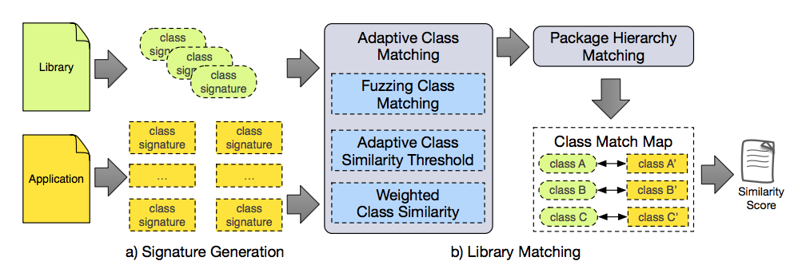

# LibPecker

<b>Detecting Third-Party Libraries in Android Applications with High Precision and Recall.</b><br/>
Yuan Zhang, Jiarun Dai, Xiaohan Zhang, Sirong Huang, Zhemin Yang, Min Yang, Hao Chen.<br/>
In Proceedings of IEEE International Conference on Software Analysis, Evolution and Reengineering, SANER’18, Campobasso, Italy, March 20-23, 2018. <a href="https://yuanxzhang.github.io/paper/libpecker-saner2018.pdf">[PDF]</a>  

## Abstract
Third-party libraries are widely used in Android
applications to ease development and enhance functionalities.
However, the incorporated libraries also bring new security &
privacy issues to the host application, and blur the accounting
between application code and library code. Under this situation,
a precise and reliable library detector is highly desirable. In fact,
library code may be customized by developers during integration
and dead library code may be eliminated by code obfuscators
during application build process. However, existing research on
library detection has not gracefully handled these problems, thus
facing severe limitations in practice.

In this paper, we propose LibPecker, an obfuscation-resilient,
highly precise and reliable library detector for Android
applications. LibPecker adopts signature matching to give a
similarity score between a given library and an application. By
fully utilizing the internal class dependencies inside a library,
LibPecker generates a strict signature for each class. To
tolerate library code customization and elimination as much
as possible, LibPecker introduces adaptive class similarity
threshold and weighted class similarity score when calculating
library similarity. To quantitatively evaluate the precision and
the recall of LibPecker, we perform the first such experiment
(to the best of our knowledge) with a large number of libraries
and applications. Results show that LibPecker significantly
outperforms the state-of-the-art tools in both recall and precision
(91% and 98.1% respectively).

## Architecture
We consider the problem of library detection in a more 
realistic scenario for application developers to incorporate third-party 
libraries, that is code customization and code elimination can occur at 
both class-level and class-member-level. In an app, there is no clear 
boundary between app code and library code, making library detection quite 
challenging. Our approach utilizes class-level similarity matching to test 
if the main functionalities of a library are still present in an application.
It takes an exact copy of a given library and an app as inputs, and 
calculates a similarity score (ranging from 0 to 1) between the library 
and the application. If the similarity score exceeds a threshold, 
LibPecker reports the library is present in the application.

As depicted in the following figure, our approach consists of 
two major parts: a) signature generation for all library classes and 
application classes; b) library matching process to give a similarity 
score between a given library and a given application based on the class 
signatures. More details can be found in our <a href="https://yuanxzhang.github.io/paper/libpecker-saner2018.pdf">paper</a>.



## Quick Start

LibPecker accepts two inputs: an Android app (.apk file) 
and a library (.dex file). LibPecker returns a similarity 
to depict how much code of the library can be found in the app. 

```
java -jar LibPecker.jar <apk_path> <lib_path>
```

To transform library files (such as .jar/.aar file), you can use the *dx* command
in the *bin* directory.

```
./bin/dx --dex --output=<lib_dex> <lib_jar_path>
```

## Test
We also provide some test cases in the *test* directory. To test these cases, 
you can run this command.

```
java -cp LibPecker.jar -Xmx4G cn.fudan.libpecker.main.TestDriver
```

Expected output is like the following.

```
=== pass test: test/apk/3f217d600168e62b062b4c424ef4224d.apk test/lib/7f799553d1957873a92a2cf96b85ef2625195788ebbf6d7ae83ff3263c114c53.dex
similarity: 0.5920433145009416
=== pass test: test/apk/3f217d600168e62b062b4c424ef4224d.apk test/lib/9798a656af89d4f6e6c0d7ad60e4863347d89503a795381e51f6e463dc32fd6d.dex
similarity: 0.14186450492182975
=== pass test: test/apk/3f217d600168e62b062b4c424ef4224d.apk test/lib/a4564e66bacf765a2cd403d274c49380dc067c4ca2449e68fa6201da2ea783d9.dex
similarity: 0.35957322333349556
=== pass test: test/apk/3f217d600168e62b062b4c424ef4224d.apk test/lib/5277a56f0c4f8a18a35a2d7e020b0546436eb81c4b5c4e492dc3cfa36436e0b4.dex
similarity: 0.5954615408654523
=== pass test: test/apk/482c5db677fbf14040c93ddeb3714526.apk test/lib/163f8315a054e25db69d7b2b8aa6097804d1d4d30003dda4ff07be21678b9587.dex
similarity: 0.33905778602924114
=== pass test: test/apk/482c5db677fbf14040c93ddeb3714526.apk test/lib/af5b684ea74defaea3a8cdc5e67bebd9ed527673c6d00b691365e7c23319da67.dex
similarity: 0.0626696274364668
=== pass test: test/apk/482c5db677fbf14040c93ddeb3714526.apk test/lib/a873ffc1d69a6d38fff2bc9b17250963f09ee934aa8f86d2abb0ba80a4d4a38f.dex
similarity: 0.5981256669903423
=== pass test: test/apk/d11006c50e299a18539c6411285660a4.apk test/lib/e466ea56ddb39d05c43912dbafcd42ae5e178e80f5ebd1e7c0c3682e040ef4a6.dex
similarity: 0.9995280792826807
=== pass test: test/apk/d11006c50e299a18539c6411285660a4.apk test/lib/1ddc4f3804cdf219ae7feaf4647a5e1d79bfc1863208fac98cba54bf4b282994.dex
similarity: 1.0
=== pass test: test/apk/bb1ae8661d82b36fa26f9fe9801943c7.apk test/lib/bdabe04fa6179d13e590f6173acbc94d9ffdbc4b4a9310a989e30820c27b94e8.dex
similarity: 1.0
=== pass test: test/apk/bb1ae8661d82b36fa26f9fe9801943c7.apk test/lib/b46bf10c7a9e4dfa24c88f87d34a9dfb5248f7718f392e1518099f8d9f69cca5.dex
similarity: 0.9490735206216379
=== pass test: test/apk/b75eef27fd4b3f5c65a8a1c7eb677d05.apk test/lib/b42266a9b224e604911716c43bf2516cce03ad551d7db213747297efd866182c.dex
similarity: 1.0
=== pass test: test/apk/b75eef27fd4b3f5c65a8a1c7eb677d05.apk test/lib/967af7be58c4efde245efea26e544d4dabb351f09f396f41b40c78d32c2723a0.dex
similarity: 0.9999999999999998
=== pass test: test/apk/b75eef27fd4b3f5c65a8a1c7eb677d05.apk test/lib/cf0d095b6db6ecedd56654228db442f152c1445d07d9cca14c6a147b2c730f5a.dex
similarity: 0.9672300793377027
=== pass test: test/apk/b75eef27fd4b3f5c65a8a1c7eb677d05.apk test/lib/bc626e62b8783e095b3fd857423ef7713de12b2a9e89fa3280e45f5a9fdd7de7.dex
similarity: 0.9708244371118012
=== pass test: test/apk/b75eef27fd4b3f5c65a8a1c7eb677d05.apk test/lib/e466ea56ddb39d05c43912dbafcd42ae5e178e80f5ebd1e7c0c3682e040ef4a6.dex
similarity: 1.0
=== pass test: test/apk/6f35b5e01899df4cc91a31f2773b7217.apk test/lib/cf819dbfef851e6f21def64d3f4b4cc5d7425104b4830ec765dc5157c4453831.dex
similarity: 1.0
=== pass test: test/apk/6f35b5e01899df4cc91a31f2773b7217.apk test/lib/7cc2314e50de4dc66de7c108ab9c429f3122c6056855fac016fe2a00a9e4ee08.dex
similarity: 0.9999999999999993
=== pass test: test/apk/b75eef27fd4b3f5c65a8a1c7eb677d05.apk test/lib/44555093604035841f936e76428e8bc2087737d58387d2718c3878481332220b.dex
similarity: 1.0
=== pass test: test/apk/b75eef27fd4b3f5c65a8a1c7eb677d05.apk test/lib/798f6bed0fca807e9b47e2f3a0a2f99e4a0618e6cf0639b3444eb72f8a4933cf.dex
similarity: 0.9999999999999997
```

## Development
To setup the development environment, you can directly open *LibPecker.iml* in *IntelliJ IDEA*.
Note that JDK 1.7 is needed.
If you have further questions, please contact *yuanxzhang [AT] fudan.edu.cn*. 

## Citation
```
@inproceedings{libpecker-saner-2018, 
    author={Y. Zhang and J. Dai and X. Zhang and S. Huang and Z. Yang and M. Yang and H. Chen}, 
    booktitle={2018 IEEE 25th International Conference on Software Analysis, Evolution and Reengineering (SANER)}, 
    title={Detecting third-party libraries in Android applications with high precision and recall}, 
    year={2018}, 
    volume={}, 
    number={}, 
    pages={141-152}, 
    keywords={Library Detection, Code Similarity, Obfuscation Resilienc}, 
    doi={10.1109/SANER.2018.8330204}, 
    ISSN={}, 
    month={March},
}
```

